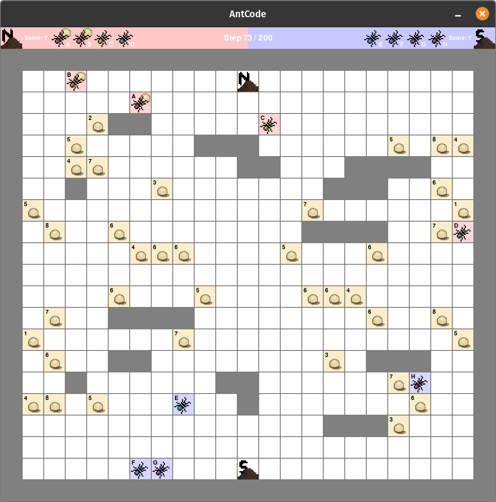
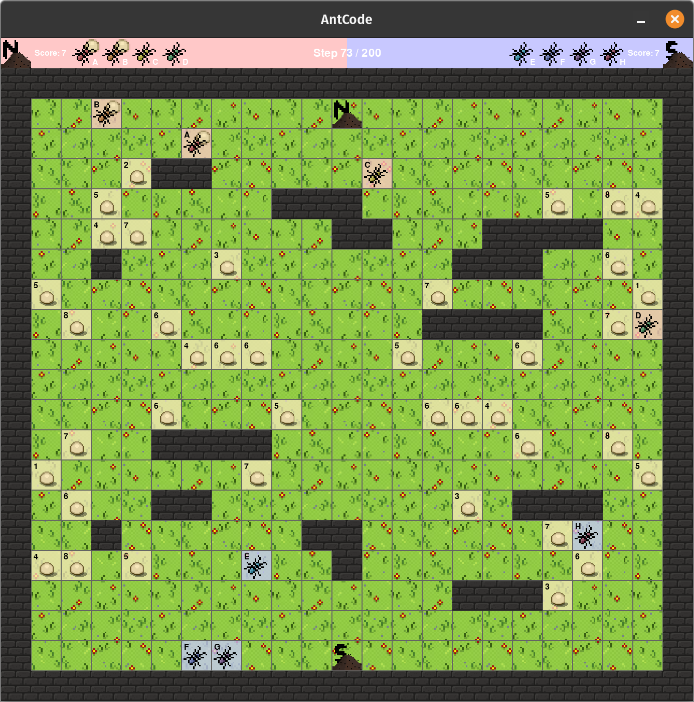

# Antcode-UI

_See [Grace-H/antcode](https://github.com/Grace-H/antcode)_

A graphical extension to the game Antcode that uses text-based console commands with Pygame.

<p align="center">
  
  
</p>


With Antcode-UI, students can: 
- visualize their [ant strategies](https://github.com/Grace-H/antcode?tab=readme-ov-file#creating-ants) in a simulated game environment
- analyze how their ants interact with the map and the rest of the team
- coordinate and strategize with their teams better

And of course, Antcode-UI is beneficial to teachers:
- record full tournaments or single games
- help students debug their ants

... and more!


## Roadmap
- Experiment with curses for streamlined console interactions


## Features
- Run, view, and control a minimalistic Pygame window, all from your console
- Intuitive text commands to play and configure the simulation
- Generate test maps and games
- Easily deployable to [CodeHS Sandbox](https://codehs.com/sandbox)


## Using Antcode-UI
Antcode UI requires [Python 3](https://www.python.org/) or above to run. _(Tested versions: 3.10.12, 3.13.0, 3.14.0a3)_

[pip](https://pypi.org/project/pip/) is the recommended package manager to use.

Clone the GitHub repository.
```
git clone https://github.com/a1silver/antcode-ui
cd antcode-ui
```

Install project dependencies.
```
pip install -r requirements.txt
```

Initialize and update Git submodules. _(Necessary for [game generation](https://github.com/Grace-H/antcode?tab=readme-ov-file#running-the-simulation) with the `gen` command)_
```
git submodule update --init
```

Run `main.py`.
```
python main.py
```
_(The proper executable might vary on different systems.)_


## Commands
| Command | Description |
| ------- | ----------- |
| load | Load a new game |
| [enter] | Toggle playback state |
| pause | Pause playback |
| play | Continue playback |
| aa | Skip to the start |
| a | Step once backward |
| s | Step once forward |
| se | Skip to the end |
| steps | View current steps out of the total |
| score | View the current score for each team |
| winner | View the game's winner |
| generate | Generate a new test map |
| config | Modify simulation settings |
| quit | Quit the simulation |

For more detailed information, run `help` in the simulation.


## Configuration
| Option         | Details |
|---------------|---------|
| pauseOnStep   | (bool) Pause the simulation instantly if the user manually steps forward or backward |
| stepsPerSecond | (int) How many times the simulation's map will advance to the next step per second |
| cellSize      | (int) How many pixels tall and wide each map cell will be |
| autoSave      | (bool) Auto-save the simulation configuration when modifying options (RECOMMENDED TO BE ON) |
| stopOnLastStep | (bool) Instantly pause the simulation when the last step is reached |
| fancyGraphics | (bool) Whether plain colors or detailed graphics are used to render certain cells |
| showTopBar    | (bool) Show or hide the panel containing key game details such as step number and team scores |
| hoverOverlay  | (bool) Show or hide the slightly transparent overlay for hovered cells |
| tooltips      | (int) Control the display of cell tooltips.<br>0: Tooltips off<br>1: Tooltips visible by pressing SHIFT<br>2: Tooltips on |
| foodpileInfo  | (int) Control the display of food pile cell info.<br>0: BG and labels disabled<br>1: BG enabled<br>2: Labels enabled<br>3: BG and labels enabled |
| antInfo       | (int) Control the display of ant cell info.<br>0: BG and labels disabled<br>1: BG enabled<br>2: Labels enabled<br>3: BG and labels enabled |


For more detailed information, run `config` in the simulation.


## Development
Want to contribute? Great!

[Fork](https://github.com/a1silver/antcode-ui/fork) the repository, push your changes, and open a [pull request](https://github.com/a1silver/antcode-ui/compare).


## Bug Reporting
Found a bug?  Let's squash it together.

Open an [issue](https://github.com/a1silver/antcode-ui/issues/new/choose) and describe the bug in as much detail as possible.


## License
MIT